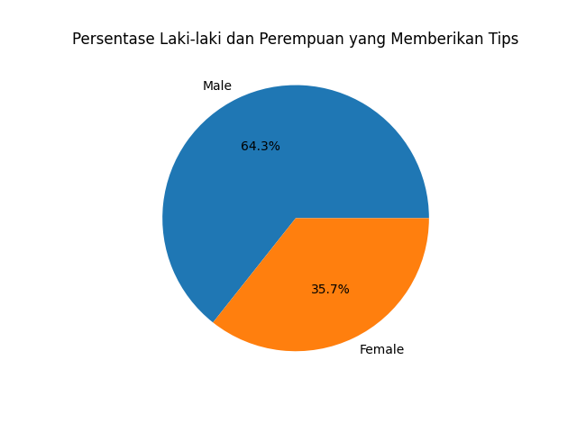
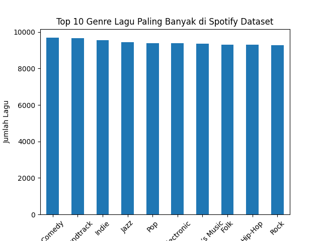

# Visualisasi Data Menggunakan Python

## Deskripsi Project

Project ini merupakan tugas eksplorasi dan visualisasi data menggunakan Python.
Pada project ini dilakukan analisis sederhana terhadap dua dataset berbeda untuk mendapatkan insight dari data yang tersedia.

Visualisasi dilakukan menggunakan library Python yaitu **pandas** untuk pengolahan data dan **matplotlib** untuk membuat grafik.

---

# Dataset 1: Tips Restoran

## Deskripsi Dataset

Dataset pertama adalah **tips.csv** yang berisi informasi mengenai pelanggan restoran dan tips yang diberikan.

Beberapa atribut dalam dataset ini antara lain:

* total_bill → total tagihan pelanggan
* tip → jumlah tips yang diberikan
* sex → jenis kelamin pelanggan
* smoker → status perokok
* day → hari kunjungan
* time → waktu kunjungan
* size → jumlah orang dalam kelompok

## Visualisasi Data

Visualisasi dilakukan untuk melihat **persentase pelanggan berdasarkan jenis kelamin yang memberikan tips**.

### Grafik



## Insight

Berdasarkan grafik yang dihasilkan, terlihat bahwa pelanggan laki-laki memberikan tips lebih banyak dibandingkan pelanggan perempuan pada dataset tersebut.

---

# Dataset 2: Spotify Music Dataset

## Sumber Dataset

Dataset kedua berasal dari platform data science **Kaggle** dan berisi berbagai fitur lagu dari Spotify seperti genre, popularity, danceability, dan energy.

Dataset yang digunakan:

```
SpotifyFeatures.csv
```

## Visualisasi Data

Visualisasi dilakukan untuk melihat **genre lagu yang paling banyak muncul dalam dataset Spotify**.

### Grafik



## Insight

Berdasarkan grafik yang dihasilkan, terlihat bahwa beberapa genre memiliki jumlah lagu yang jauh lebih banyak dibandingkan genre lainnya dalam dataset Spotify.

Hal ini menunjukkan bahwa genre tersebut lebih dominan dalam dataset yang digunakan.

---

# Teknologi yang Digunakan

Project ini menggunakan beberapa tools dan library berikut:

* Python
* pandas
* matplotlib
* Visual Studio Code

---

# Cara Menjalankan Program

1. Install library yang dibutuhkan

```
pip install pandas
pip install matplotlib
```

2. Jalankan program visualisasi

Visualisasi dataset tips:

```
python visualisasi_tips.py
```

Visualisasi dataset Spotify:

```
python visualisasi_spotify.py
```

---

# Kesimpulan

Melalui visualisasi data menggunakan Python, kita dapat memperoleh insight sederhana dari dataset yang digunakan.

Pada dataset tips restoran, visualisasi menunjukkan perbedaan kontribusi tips berdasarkan gender pelanggan.
Sedangkan pada dataset Spotify, visualisasi menunjukkan distribusi genre lagu yang paling banyak muncul dalam dataset.

Project ini menunjukkan bagaimana visualisasi data dapat membantu memahami pola dalam dataset dengan lebih mudah.
